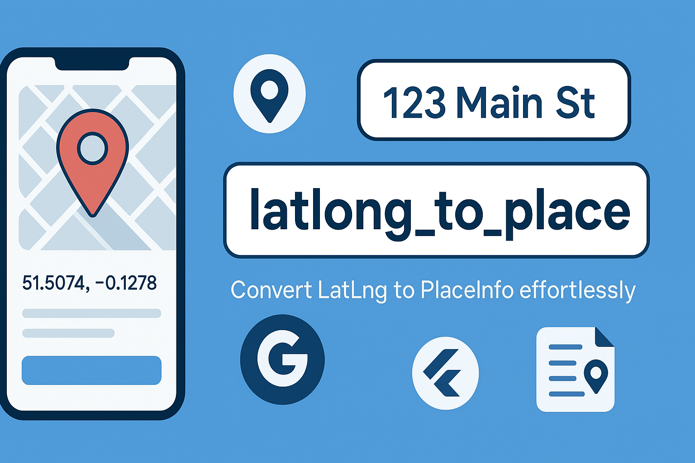
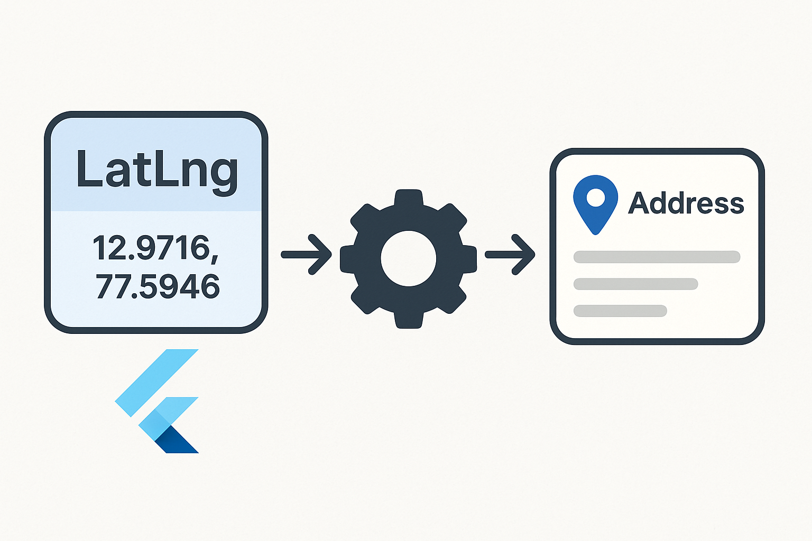

# latlong_to_place





A Flutter library to fetch the device’s current latitude/longitude via **geolocator** and convert it into detailed `PlaceInfo` (address components, city, state, country, etc.) via the null-safe **geocoding** plugin.

---

## Features

- 🗺️ **getCurrentPlaceInfo()** – asks for permission, fetches GPS coords, then reverse-geocodes.
- 🔄 **getPlaceInfo(lat, lng)** – reverse-geocode any coordinates.
- 🎯 Returns a `PlaceInfo` with:
  - `formattedAddress`
  - `street`
  - `locality`
  - `city`
  - `state`
  - `country`
  - `postalCode`
  - `latitude`
  - `longitude`

---

## Installation

Add to your app’s `pubspec.yaml`:

```yaml
dependencies:
  latlong_to_place: ^0.0.1